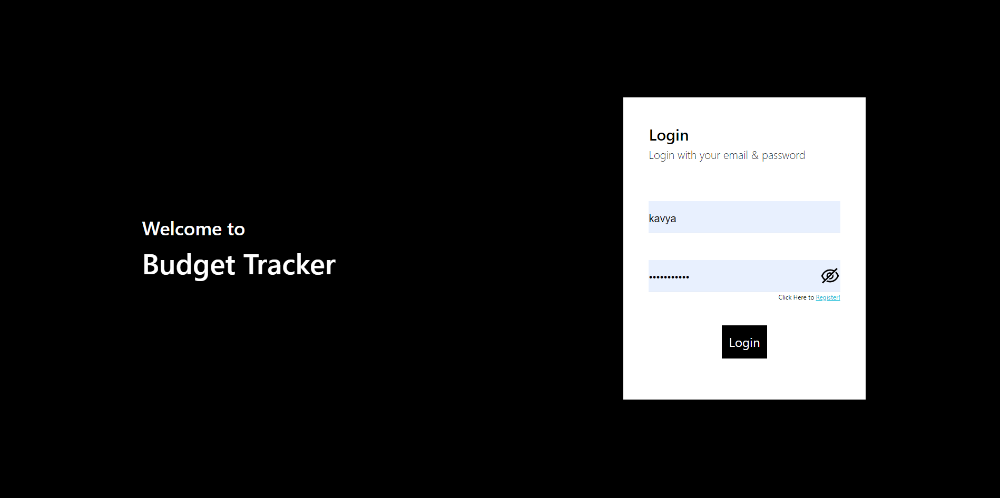
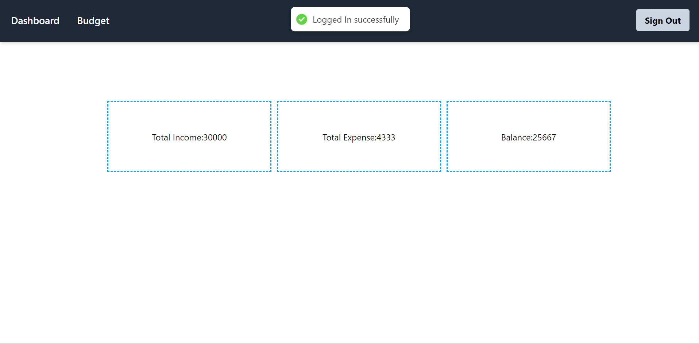
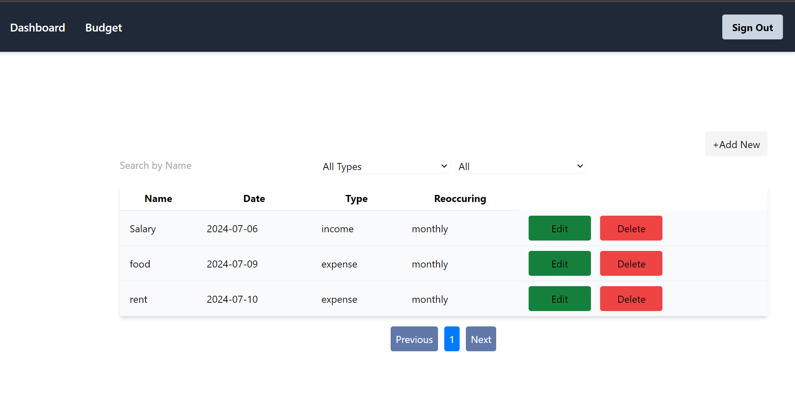
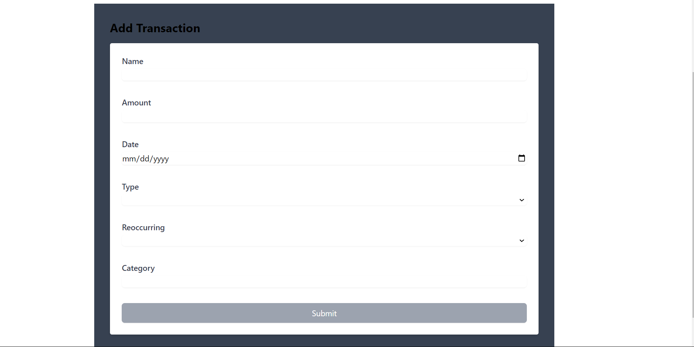

## Budget Track

This project is a small application that is used for tracking the income and expense of a user. Each user can create thier own account with email, username and password. After the account is created successfully, using the provided email and password while registration, user can access the application. After the user is signed in, the user is redirected to the dashborad page where user can view their total income, expense and balance. On the navbar, a budget page is also avaiable where user can initially view the list of thier added transactions. An clicking the add button the user is redirected to the form where user can fill the details. The filled detail is shown on the list in the budget page where user can also delete and edit the details. The application also has search, filter, and pagination functionalities to help users easily navigate through their data.

## Requriment

Node.js, VsCode

## Getting Started

```
git clone https://github.com/kavya1234556/budget-tracker.git

npm install
npm run start

```

The app will be available at [http://localhost:3000/]

## Project Structure

```bash
budget-tracker/
├── public/
│ ├── index.html
│ └── ...
├── src/
│ ├── images/
│ │ └──img.jpg
│ ├── pages/
│ │ ├── Auth/
│ │ │ ├── Login/
| | | | ├──hooks/
| | | | | └── useLogin.js
│ │ │ | └── index.jsx
| | | └── Register
│ │ │ | ├──hooks/
| | | | | └── useRegister.js
│ │ │ | └── index.jsx
| | | |
│ │ ├── Budget/
│ │ │ ├── hooks/
| | | | └── useAddEditBudgetForm.js
│ │ │ ├── edit-add-budget-page.jsx
│ │ │ └── index.jsx
│ │ │
│ │ └──dashboard/
│ │ └── index.jsx
│ │
│ ├── components/
│ │ ├── Navbar/
│ │ └── index.jsx
│ │ └── input-password.jsx
│ |
│ ├── routes/
│ │ ├── bugetRoute.jsx
│ │ ├── index.jsx
│ │ ├── ProtectedRoute.jsx
│ │ └── PublicRoute.jsx
| |
│ ├── App.js
│ ├── index.js
| ├── pagination.css
│ └── index.css
├── .gitignore
├── package.json
├── README.md
├── package-lock.json
└── tailwind.config.js
```

## Manual

### Register Page


### Login Page



## Dashborad Page


x

## Budget Page



## Add Budget Form


